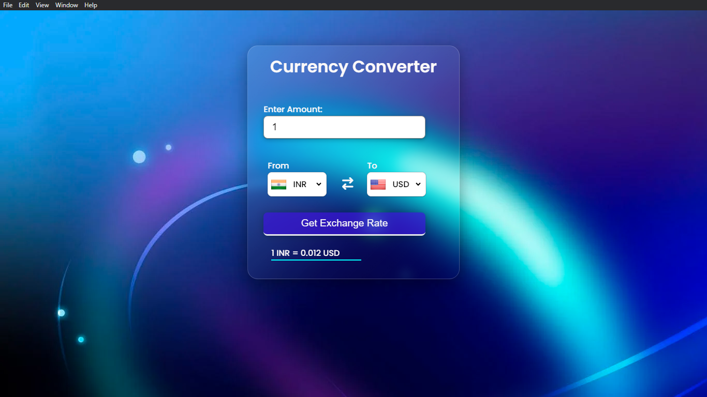
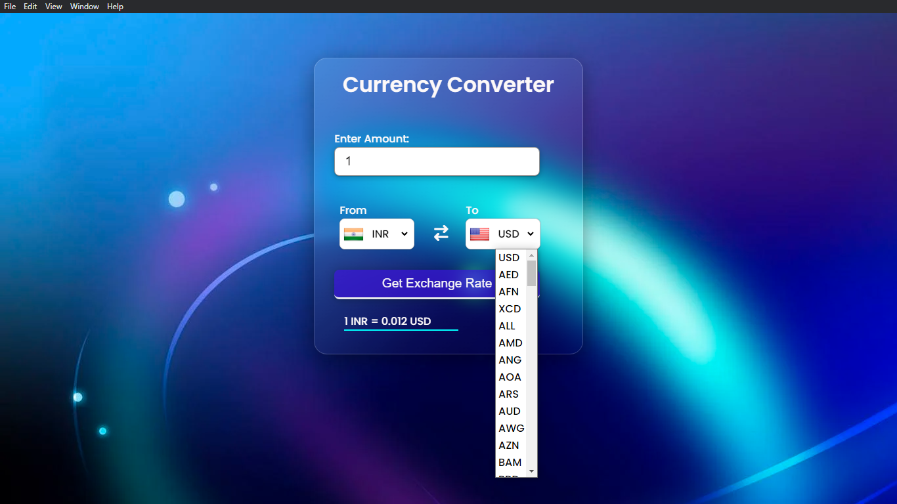
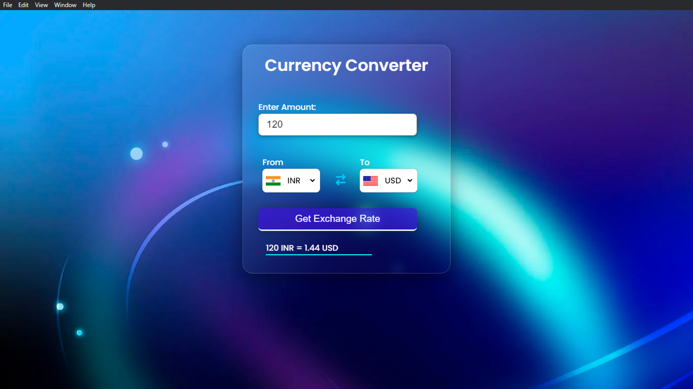

# Welcome to Currency Converter 💱 💸 👓 🚀

## A Currency Converter Application for Windows applications build using Electron.js

### This the starting page for currency converter 




### You can convert over 100+ countries currency into different currencies 



### For getting the conversion of desired country currency you just need to select from the select tag and then 
### to which country you want to convert. Also You can enter the amount of money you want to convert 
** For example here I am converting 120 USd dollars to Bharat(before known as India) rupees.


** You can see the output **

### If you want to switch between the same country's in the options you can just click the switch icon between 
### them and can switch between them in an second and convert accordingly. 
**See the example below for more details. **




## For Running it locally into Your system `#0969DA` 
## Follow the Below Steps >
```
git clone https://github.com/deepakthecoder1982/currency_converter.git

<!-- Make sure that Node is installed in your system for running and working on this application -->
<!-- Then For Running the application follow below steps -->

cd currency_converter

npm install 

npx electron .

<!-- Congratulations You have succesfully run the application in your system!! -->
```

## If you have anything to share with me or wanted to provide me any feedback, please feel free to connect with me over my linkdin account or email address. Also If you stuck somewhere don't hesitate to contact me at my email address below :- 
`
Linkedin Account :- https://www.linkedin.com/in/deepak-archana-mahesh-yadav/

Email Address :- deepakyad18@gmail.com 
`

### Thank you for reading till this !! Have a great future ahead 

# Keep Coding ! Keep Exploring !
